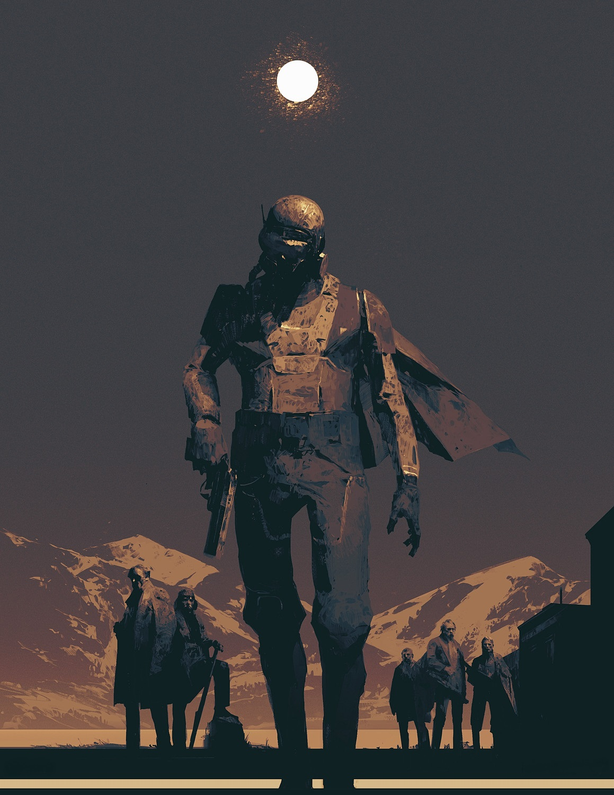
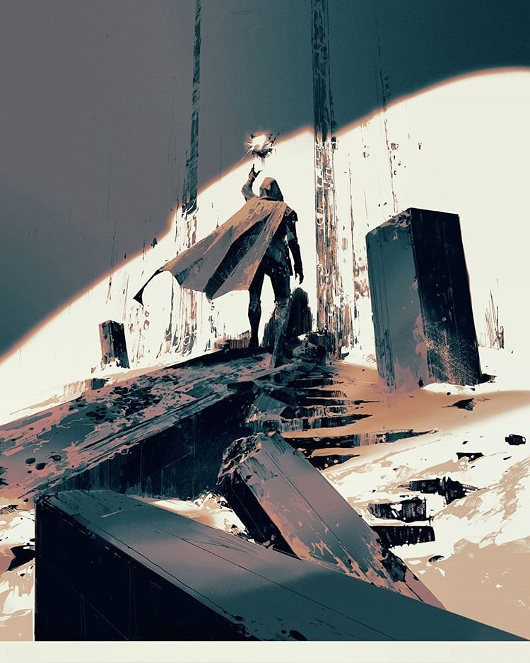
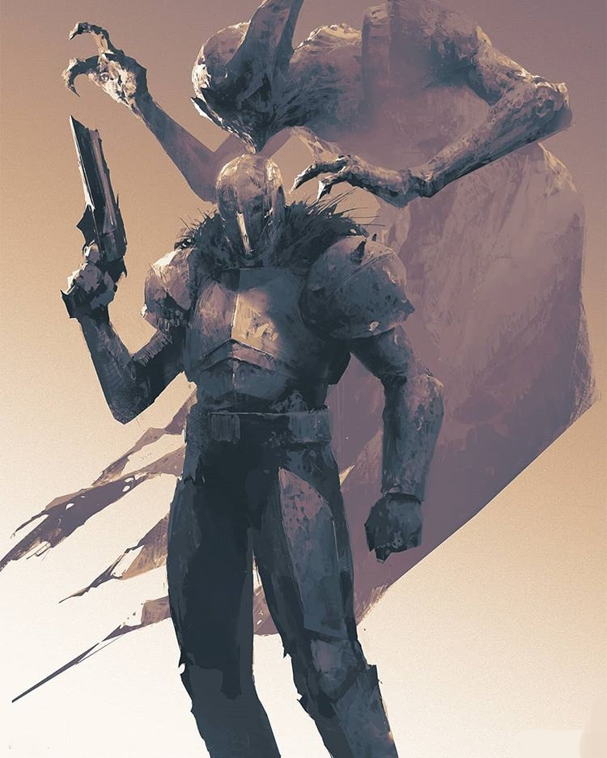

# B L A C K  S U N #

---

**Game Administrator:** *Kordell Stewart*  

**Base System:** *Stars Without Number - Revised Edition*    **Supplements In Use:** *Codex of the Black Sun*

---

## **Welcome to the End** ##

Welcome to the twilight of the 2nd millennium! In this game I hope to explore weird ideas of transhumanism, post-scarcity societies, and what conflicts the last humans and the things that come next get into amongst a background of weird dimensional phenomena, mysticism, and decline.   

My major influences that got into my mind during the making of this game: 

- **Books:**
  - [Altered Carbon](https://en.wikipedia.org/wiki/Altered_Carbon) by Richard K. Morgan
  - [Dune](https://en.wikipedia.org/wiki/Dune_(novel)) by Frank Herbert
  - [Starship Troopers](https://en.wikipedia.org/wiki/Starship_Troopers) by Robert A. Heinlein
  - [The Night Land](https://en.wikipedia.org/wiki/The_Night_Land) by William Hope Hodgson
- **Games:**
  - [Anthem](https://en.wikipedia.org/wiki/Anthem_(video_game)) by BioWare Edmonton
  - [Death Stranding](https://en.wikipedia.org/wiki/Death_Stranding) by Kojima Productions
  - [Destiny 1 & 2](https://en.wikipedia.org/wiki/Destiny_(video_game)) by Bungie
- **Music:**
  - [I Shall Die Here](https://www.youtube.com/watch?v=6oWxfAvJKhE) by The Body
  - [Ghost in the Shell OST](https://youtu.be/GvaC6cIrntI) composed by Kenji Kawai

Along with countless other pieces of art and media that wormed their way into my mind. 

---

> *The future is very dark...* 
>
> *Foul, small-minded deities have emerged from the heart of the rock...* 
>
> *And beings of flesh and blood, like us, are celebrating this atrocious event.*
>
> – Giorgio De Maria, “The Twenty Days Of Turin”

---

## **The Era of Prosperity** ## 

We called it the **BLACK SUN** and its advent changed us forever. The Mandate learned much knowledge from it. Great bastions were built on Mars and Venus. Mercury became a lush paradise. Human lifespan tripled. The Soul was discovered. The Grails were constructed. It was an age of miracles. We looked out at the galaxy and knew that it was our fate to walk in the light of other stars. To walk with the wisdom and power granted by the **BLACK SUN**. But the incarnation of the **BLACK SUN** had an unforeseen consequence: the **ABYSM**, which haunted the black gulfs between the folds space for untold eons. Centuries after humanity’s Era of Prosperity had began, the ABYSM found us, and that was the End of everything.  

---

## **Many Years From Now…**

Here hath the Earth been despoiled. 

Now, centuries after the End, the Earth is in ruins. Civilization as it was known is no more. The infrastructure of the Mandate is in forgotten shambles. Contact with other planets has ceased entirely. The Earth itself has suffered as well. Some seas have been boiled away while others have surged inland. The worst continents are devoid of even the most basic life. Others have strange life abound. The landscape is scarcely recognizable as Earth in some areas. The unstable meta-dimensional currents of the system wreak havoc as wild energies rake across the void. 

Humanity, or rather what is left of humanity, is currently in a dark age. Survivor enclaves on Earth live in small towns and outposts hidden away or dwell deep in the great ruins of Prosperity Era cities and abandoned Mandate bases. Post-human enclaves in the void seek to claim their independence from the ruined throne of humanity. 

The largest concentration of humans live in the Redoubt, the last of the great bastions. Behind it’s walls and protected by the **BLACK SUN**, they are provided for by the last known Greater Grail, a massive synthesis engine that take raw feed-stock and fabricate it into almost anything imaginable. 

From the ranks of the forgotten dead, the **BLACK SUN** reaches out and claims those worthy to wield a fragment of its might. These chosen are blessed with powerful Souls. Souls imbued with incredible power and capable of defying death itself. These eternal few are the Wardens, avatars of the **BLACK SUN** and the last hope for humanity.

The Wardens are not the only ones to take heed of the **BLACK SUN**. Drawn by the powerful call of the **BLACK SUN**, vile forces from outside the system have sunk their teeth deep into the various planets, including Earth. Alien warlords and conquerors, terrors from the void of space, rogue AIs of the Prosperity Era, and paracausal beings from beyond have turned their attention to the ruined realm of humanity. 

Despite this, humanity and the Wardens are not without discord and conflict. Several ambitious factions and splinter groups have festered and grown with different ideas on how to wield the power of the **BLACK SUN** and what humanity must do to survive…or transcend further.

---

## **The Regencies** ##

The Convergence is the governing body of the Redoubt. It is made up of five recognized Regents, each the leader of a Regency. Wardens almost exclusively make up the higher ranks of these factions, but there are rare exceptions. The current Regencies are: 

- **Garrison**, High Commander Yin Song
  - It’s Wardens are called *Guardians*. 
  - It is the largest of the five Regencies; it was the first to secure the bastion that would become the Redoubt and established the Convergence. 
  - See cooperation and unity between Wardens as the key to leading humanity’s survival. 
  - Primarily concerned with the Redoubts security, stability, and future.
  - Manage and control the Redoubt Defense Force (R.D.F) 
- **The Keepers of Infinity**, Prime Overseer KOTHAR-7
  - It’s Wardens are called *Keepers*. 
  - An elitist technocracy which looks to reclaim Prosperity Era technologies.  
  - Maintain, control, and operate the Greater Grail and lesser Grails in the Redoubt. 
  - Resent reckless or careless use of resources and tech. 
- **New Eternity Cult**, Black Hierophant Ilios Morn
  - It’s Wardens are called *Cultists*. 
  - Spiritual leaders of the Redoubt. 
  - Warrior-scholars who revere and develop the powers of the **BLACK SUN**. 
  - Study MES, SANIS, Souls, psitech, and arcanotech development. 
- **Freelancers**, Captain Carlos Arellano
  - It’s Wardens are called *Lancers*. 
  - Value personal freedom and cooperation. 
  - Want to protect and serve humanity, not lead them. 
  - Support outposts and settlement attempts outside of the Redoubt.
- **Outer Reach**, Seeker Lord Saladin Cross
  - It’s Wardens are called *Outriders*. 
  - Thrill-seeking explorers, daring pilots, and radical thinkers who largely see Earth itself as a lost cause.
  - Strive to find a new home for humanity and ascend past the miracles of the Prosperity Era by any means. 
  - Have close ties with elements in the Verge. 

---

## **Rules and Mechanics**

The following section details the rules and mechanics of the campaign. My commentary on certain decisions will be in *italics* and noted as such. 

### Core Systems 

We will be using all of the Core systems of the game. Notably we will be using the defualt hacking rules intstead of the Net and Digital combat. We will be using the *Soft Transhumanism* rules rather than the Hard ones and refluffing to fit our theming, tone, and setting. Our Shell fluff will also differ slightly. 

*Commentary: The Net and such are really cool but harder to execute their innate 'transhuman corporation intrigue' elements when you are outside of the Redoubt. If the campaign had a more urban and human focus setting, I feel that it would be more of an advantage in terms of GM and player engagement.* 

### Character Creation

*When you are chosen by the* **BLACK SUN** *you are made anew.*

In this game we will be playing as a fireteam of Wardens. Wardens are the elite last line of humanity in almost all regards: braving unknowns, facing dangers, and doing anything (fighting, rescuing, research, diplomacy) to preseve humanity. Fresh Wardens are just as effective as the average person, having no training or knowledge of what has been done to them or how to wield it. 

*You are different.*

*You have been taught.* 

*You have been trained.*

*And you are mighty indeed.*

While your life before is a series of hazy memories you are a new person. Perhaps a completely different person. Gifted a Soul and a perfect body, inducted into an organization that imparts upon you everything necessary to utilize your powers and hold back extinction.  

*Commentary: Wardens aren't incapable of folly (indeed some even go rouge!) but the basic training of a fireteam is one of forging a group of Warden Initiates into a cohesive, independent, and fierce team. They may not get along, they may hate each other, they may be the best of friends, but when push comes to shove they click and they work as a unit.* 

Character creation is as normal with a couple of notes: 

- Species-wise, your character can be Human or Alpha.
  - I would be open to VI characters - not Wardens but fireteam support units, no psychic/magic class or foci, but still potent with the best of the best design
- We will most likely be using the Heroic rules of the game to represent potent and flexible characters (yeah the fireteam tech can breach the target security in a snap, but they could also take down the guard that stumbled upon them). 
- All classes are available save for the following: 
  - Yama King - not setting or game appropriate
  - True AI - NPC only
  - Godhunter - too focused to be setting appropriate
- All Wardens start with the Prime Organic ‘shell‘ automatically. This represents the perfect body reformed around your Soul. Rather than something manufactured, this was something *created* specifically for you by the BLACK SUN. All stats will still be rolled but this represents the 'baseline' you're elavated to in  body reforged by the BLACK SUN. 
- All Wardens start with a Soulstone, a perfectly black, reflective fragment of the BLACK SUN that retains your Soul. A Warden can manifest their Soulstone as an On Turn action. If a character is reduced to zero hit points, it will automatically manifest over them and emit flairs of energy, automatically stabilizing the body. It is particularly vulnerable and noticeable during this state and can be targeted. It will survive anything short of a direct attempt to destroy them with a Heavy weapon or similar destructive force/situation. If the body follows normal rules and will die if further damage is inflicted, leaving the Soulstone to be recovered. The Soulstone can be transferred between BLACK SUN forged bodies. 
  - On a related mechanical note: This means no backup tanks, no digital shells (we aren’t using hacking like that anyway), and mechanical shells have a bit of a pariah effect. I see them as prisoner bodies, meant to cut off a Warden from the immortality of the BLACK SUN. Not something ok or accepted. Since rogue wardens can’t forge new bodies, I see no small amount of rogue, banished, or imprisoned wardens being mechanical in heavily modified bodies to make up for their lost support from the BLACK SUN. 
  - *Commentary: This comes from me wanting to make the body swapping bit less “classic transhuman” and a little more weird and esoteric. I see the NEC pouring the black matter of the SUN into tanks and molds to literally ‘forge’ and grow new bodies. Less of a science and more a manipulated phenomena.* 

### Equipment

A note on the Grails:

The Redoubt and the Keepers intentionally restrict the scope of material goods that can be created by personal grails, trying to both preserve the uniqueness of certain objects by legal fiat and attempting to keep the rank and file from producing weapons of mass destruction or culturally-despised artifacts. Such restrictions are largely accepted by civilian populace, though black-markets and underground methods of bypassing this aren’t entirely unheard of despite their risk.

In the Redoubt, money still exists and controls the distribution of resources. While many goods are so functionally cheap as to be free, major constructions and elaborate technology requires people to pay credits to acquire them, assuming the local grail can produce what they need. Without such availability, they’ll be forced to hire skilled workers to create their desired goods, a prospect which is extremely expensive in most transhuman settings. Human time and attention is always precious in such places. 

A cutting-edge milspec experimental rifle might require certain privileges and time for a Warden to requisition, a professional gun smith in the Redoubt could make a comparable weapon for a price or a favor. 

As such, players start with 5,000 civilian credits and any personal, *civilian*-certified equipment they want provided it can fit in their current living arrangement (in the Redoubt barracks, faction district, a civilian apartment, etc.). 

A players *issued* equipment will be the standard Warden Initiate kit with slight dependencies on their role in fireteam. These are free of charge. While the contents of said kit are largely standard, the *look* of said kit varies quite a bit and varies from Warden to Warden, faction to faction, etc. 

---
  

